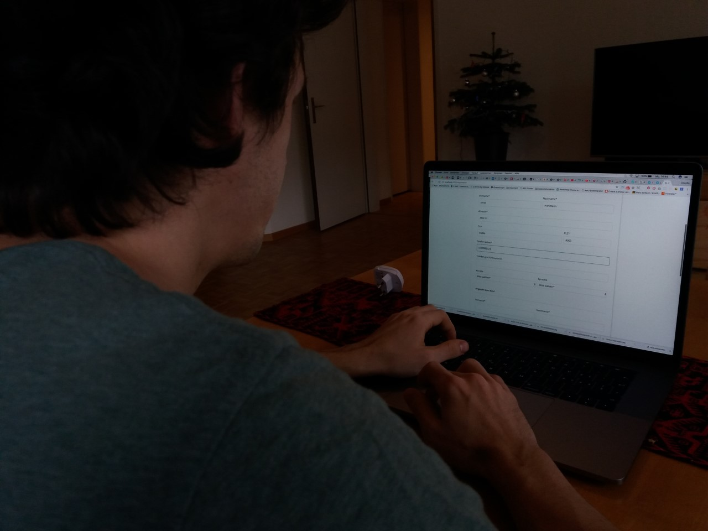

<h1>User-Test mit Jonas</h1>

<h1>Feedback/Ergebnis:</h1>

<h2>Registrierung an der Schule Klasse 4ab</h2>
Anrede sollte "Frau" und "Herr" sein, nicht "Frau" und "Mann" 
Datapicker: es sollte das Startdatum zurückgesetzt werden, sonst muss man 1000 Mal klicken, bis man beim eigentlichen Jahr ist 
(wurde umgesetzt)

<h2>Schreiben Sie der Person Test eine Email</h2>

Hat geklappt 

<h2>Schreiben Sie eine Kurzmitteilung den Eltern von Test, dass er sein Turnzeug vergessen hat.</h2>

Es ist nicht klar, dass das die E-Mail an Eltern gehen und nicht an Kind
User-Details in Classslist und Tabelle sollte noch entsprechen gekenntzeichnet sein
Die User-Details sollten über das Bild in Tabelle erreichbar sein
Aufteilung in User-Details sollten mit Titel gekenntzeichnet sein (Title Kind und Titel Eltern) - Adresse gehört zu den Eltern
Kind = Name, Geburtstag, Klasse, Klassenlehrer
Eltern = Name, Adresse, Telefonnummer, Sprache und Registrierung 
(wurde umgesetzt)

<h2>Aendere Dein Passwort</h2>

Hat geklappt

<h2>Neues Profilbild hochlangen</h2>

Button "Bild austauschen" mit Speichern versehen, er versteht sonst nicht, warum das Bild nicht ausgetauscht ist, wenn er das Bild ladet 
(wurde umgesetzt)

<h2>Sonstiges</h2>

Footer: Links führen auf keine Page 
(wurde umgesetzt)

