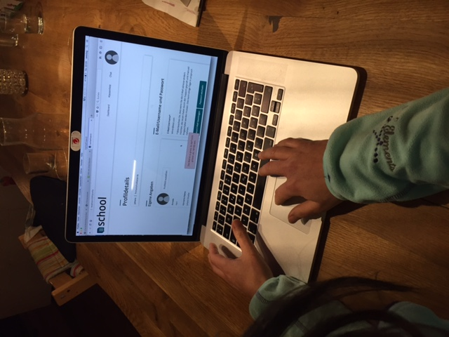

*User-Test mit Lehrerin (Roya)*

Vorbedingung: Login als Lehrerin: Benutzername: lehrer@test.com password: test99!

*Feedback/Ergebnis:*

**Registrierungsprozess: Bestätige den Benutzer heidi@test.com**

hat geklappt

**Schreibe an heidi@test.com eine Email**

hat geklappt

**Schreibe eine Kurzmitteilung an Zoe, dass sie ihr Turnzeug vergessen hat**

Testbeschrieb zu unklar, konnte die Aufgabe so nicht lösen. Dachte, dass man müsse 
einen indivduellen Chat schreiben können.

**Ändere Dein Passwort**

hat geklappt

**Füge ein neues Profilbild ein**

Vergas zu "Bild austauschen", hat aber behauptet sie hätte geklickt.
