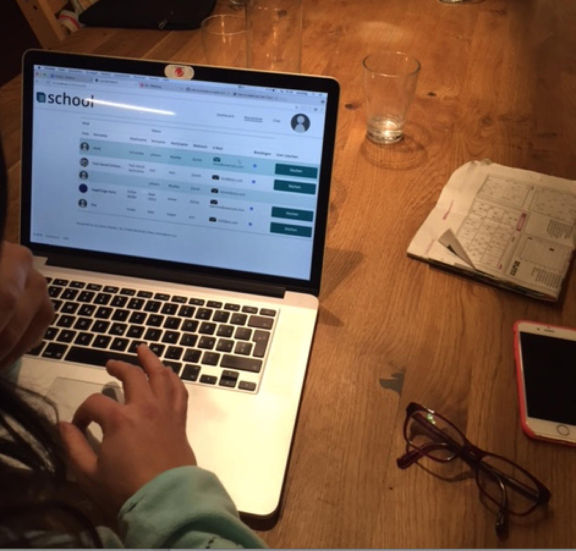

<h1>User-Test mit Lehrerin (Roya)</h1>

Vorbedingung: Login als Lehrerin: Benutzername: lehrer@test.com password: test99!

<h1>Feedback/Ergebnis:</h1>

<h2>Registrierungsprozess: Bestätige den Benutzer heidi@test.com</h2>

hat geklappt

<h2>Schreibe an heidi@test.com eine Email</h2>

hat geklappt

<h2>Schreibe eine Kurzmitteilung an Zoe, dass sie ihr Turnzeug vergessen hat</h2>

Testbeschrieb zu unklar, konnte die Aufgabe so nicht lösen. Dachte, dass man müsse 
einen indivduellen Chat schreiben können.

<h2>Ändere Dein Passwort</h2>

hat geklappt

<h2>Füge ein neues Profilbild ein</h2>

Vergas zu "Bild austauschen", hat aber behauptet sie hätte geklickt.
